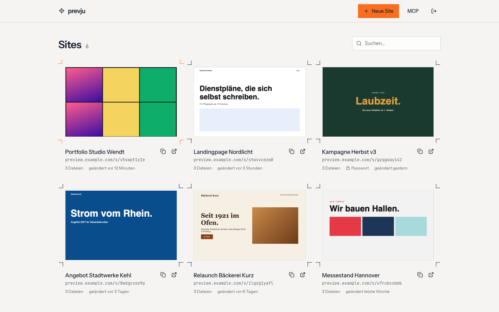

# prevju

[](https://github.com/baeroe/prevju/actions/workflows/tests.yml)
[](https://hub.docker.com/r/baeroe/prevju)

Self-hosted previews for HTML drafts. Upload a folder, send the link to your client, optionally with a password.

**Docs: [prevju.dev](https://prevju.dev)**



## Quick start

`docker-compose.yml`:

```yaml
services:
  prevju:
    image: baeroe/prevju:latest
    restart: unless-stopped
    ports:
      - "7738:8080"
    environment:
      APP_URL: "${APP_URL}"
      ADMIN_EMAIL: "${ADMIN_EMAIL}"
      ADMIN_PASSWORD: "${ADMIN_PASSWORD}"
    volumes:
      - prevju-data:/var/www/html/storage/app

volumes:
  prevju-data:
```

`.env` next to it:

```bash
APP_URL=https://preview.example.com
ADMIN_EMAIL=admin@example.com
ADMIN_PASSWORD=change-me
```

```bash
docker compose up -d                              # start
docker compose pull && docker compose up -d       # update
```

Open `APP_URL`, log in with `ADMIN_EMAIL` / `ADMIN_PASSWORD`. HTTPS via a reverse proxy in front of port 7738.

## Docs

- [Setup](https://prevju.dev/en/setup) and [Reverse proxy](https://prevju.dev/en/reverse-proxy)
- [What works](https://prevju.dev/en/what-works): relative paths, Vite/CRA builds, SPA routing
- [MCP](https://prevju.dev/en/mcp): upload drafts from Claude Code or Codex
- [Upgrading](https://prevju.dev/en/upgrading)

The docs live in [`docs/`](docs) (VitePress). Run them locally with `cd docs && npm install && npm run dev`.

## Release

Push a tag, GitHub Actions builds the image for amd64 and arm64, pushes it to Docker Hub and creates a GitHub release:

```bash
git tag v1.0.0 && git push origin v1.0.0
```

## License

[MIT](LICENSE)
